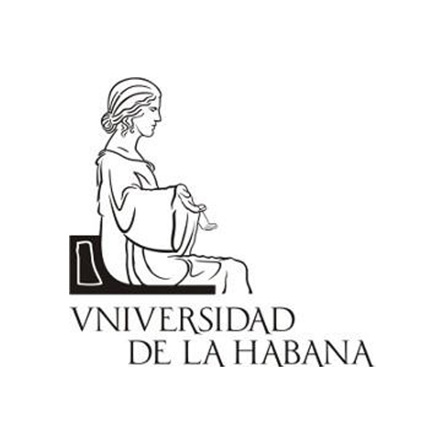

# IberLEF eHealth Knowledge Discovery Challenge 2024

> ### 🗨️ Follow [@EHealthKD](https://twitter.com/EhealthKd) on Twitter for up-to-date information.

<!-- > ### 🏆 As of **May 4th, 2021** the official results are available (read below)! -->

---

Natural Language Processing (NLP) methods are increasingly being used to mine knowledge from unstructured health texts. Recent advances in health text processing techniques encourage researchers and health domain experts to go beyond just reading the information in published texts (e.g., academic manuscripts, clinical reports, etc.) and structured questionnaires to discover new knowledge by mining health content. This has allowed other perspectives that were not previously available to surface.

Over the years, many eHealth challenges have attempted to identify, classify, extract, and link knowledge, such as Semevals and CLEF campaigns.

The 2024 eHealthKD edition is focused on a single task - identifying and classifying elements in English health documents. This NERC problem allows generated annotations to be multiword, multiclass, and overlap with other annotations (Overlapping Named Entity NERC task). The objective is to produce an NLP model to perform the defined task, automatically generating annotations (entities) given a medical text.

The corpus consists of abstracts from particular papers obtained from *Web of Science*. The annotations were produced through automated means and then verified manually. The taxonomy was created by refining the Semantic Types of UMLS and selecting 40 types. Some were merged and refined from the 127 original types until the final list of 40 types was achieved. We present the complete list of these 40 types below.

Additional details about the corpus, the taxonomy, and the annotation process are provided at the end of this document. The evaluation process will be done simultaneously, measuring the detection and classification steps in the same formulas. An example of the semantic structure is provided in the following figure.


This challenge could be of great interest to experts in the field of natural language processing, particularly those who are working on automatic knowledge extraction and discovery. Furthermore, researchers in the eHealth domain could also benefit from this challenge by evaluating their technologies that rely on health domain knowledge.

<!-- ## Programme -->

<!-- Online on September 21, 2021. Registration requiered at: [CEDI](http://www.hitz.eus/sepln2021/?q=node/12)

| | From | To | Description| Bibtext| Video | Paper|
|-|------|----|---------------------------|----|----|----|
|-|**12:30h**|**14:00h**|**eHealth-KD 2021: eHealth Knowledge Discovery**|
|-|12:30h|12:50h|Overview of the eHealth Knowledge Discovery Challenge at IberLEF 2021 *Alejandro Piad-Morfis, Suilan Estevez-Velarde, Yoan Gutierrez, Yudivian Almeida-Cruz, Andrés Montoyo, Rafael Muñoz*| [@](https://raw.githubusercontent.com/ehealthkd/ehealthkd.github.io/master/docs/pages/2021/bibtex/overview_ehealthkd2021.bib)| [🎥](https://github.com/ehealthkd/ehealthkd.github.io/raw/master/docs/pages/2021/videos/eHealth-KD-2021_Overview_10min.mkv) | [📄](http://journal.sepln.org/sepln/ojs/ojs/index.php/pln/article/view/6392)| 
|-|12:50h|13:00h|Vicomtech at eHealth-KD Challenge 2021: Deep Learning Approaches to Model Health-related Text in Spanish. *Aitor García-Pablos, Naiara Perez, and Montse Cuadros*| [@](https://raw.githubusercontent.com/ehealthkd/ehealthkd.github.io/master/docs/pages/2021/bibtex/Vicomtech_eHealth-KD.bib)| [🎥](https://github.com/ehealthkd/ehealthkd.github.io/raw/master/docs/pages/2021/videos/eHealth-KD-2021_1min_video_Vicomtech.mp4)| [📄](http://ceur-ws.org/Vol-2943/ehealth_paper6.pdf)|
|-|13:00h|13:10h|PUCRJ-PUCPR-UFMG at eHealth-KD Challenge 2021: A Multilingual BERT-based System for Joint Entity Recognition and Relation Extraction. *Lucas Pavanelli, Elisa Terumi Rubel Schneider, Yohan Bonescki Gumiel, Thiago Castro Ferreira, Lucas Ferro Antunes de Oliveira, João Vitor Andrioli de Souza, Giovanni Pazini Meneghel Paiva, Lucas Emanuel Silva e Oliveira, Claudia Maria Cabral Moro, Emerson Cabrera Paraiso, and Adriana Pagano*| [@](https://raw.githubusercontent.com/ehealthkd/ehealthkd.github.io/master/docs/pages/2021/bibtex/PUCRJ_PUCPR_UFMG_eHealth-KD_2021.bib)|[🎥](https://github.com/ehealthkd/ehealthkd.github.io/raw/master/docs/pages/2021/videos/eHealth-KD-2021_1min_video_PUCRJ-PUCPR-UFMG.mp4) |[📄](http://ceur-ws.org/Vol-2943/ehealth_paper3.pdf)|
|-|13:10h|13:20h|IXA at eHealth-KD Challenge 2021: Generic Sequence Labelling as Relation Extraction Approach. *Edgar Andrés*| [@](https://raw.githubusercontent.com/ehealthkd/ehealthkd.github.io/master/docs/pages/2021/bibtex/Edgar_Andres_eHealth-KD_2021.bib)| [🎥](https://github.com/ehealthkd/ehealthkd.github.io/raw/master/docs/pages/2021/videos/eHealth-KD-2021_1min_video_IXA.mp4)| [📄](http://ceur-ws.org/Vol-2943/ehealth_paper1.pdf) |
|-|13:20h|13:30h|Round of short presentations | | | |
|-|      |      |JAD at eHealth-KD Challenge 2021: Simple Neural Network with BERT for Joint Classification of Key-Phrases and Relations. *José Gabriel Navarro Comabella, Jorge Daniel Valle Diaz, Alberto Helguera Fleitas* |[@](https://raw.githubusercontent.com/ehealthkd/ehealthkd.github.io/master/docs/pages/2021/bibtex/JAD_eHealth-KD_2021.bib)|[🎥](https://github.com/ehealthkd/ehealthkd.github.io/raw/master/docs/pages/2021/videos/eHealth-KD-2021_1min_video_JAD.mp4) | [📄](http://ceur-ws.org/Vol-2943/ehealth_paper2.pdf)|
|-|      |      |UH-MMM at eHealth-KD Challenge 2021: *Loraine Monteagudo-García, Amanda Marrero-Santos, Manuel Santiago Fernández-Arias, Hian Cañizares-Díaz* |[@](https://raw.githubusercontent.com/ehealthkd/ehealthkd.github.io/master/docs/pages/2021/bibtex/UH-MMM_eHealth-KD_2021.bib)|[🎥](https://github.com/ehealthkd/ehealthkd.github.io/raw/master/docs/pages/2021/videos/eHealth-KD-2021_1min_video_UH-MMM.mp4) | [📄](http://ceur-ws.org/Vol-2943/ehealth_paper4.pdf)|
|-|      |      |uhKD4 at eHealth-KD Challenge 2021: Deep Learning Approaches for Knowledge Discovery from Spanish Biomedical Documents: *Dayany Alfaro-González, Dalianys Pérez-Perera, Gilberto González-Rodríguez, Antonio Jesús Otaño-Barrera, Rocío Cruz-Linares* |[@](https://raw.githubusercontent.com/ehealthkd/ehealthkd.github.io/master/docs/pages/2021/bibtex/uhKD4_eHealth-KD_2021.bib)| [🎥](https://github.com/ehealthkd/ehealthkd.github.io/raw/master/docs/pages/2021/videos/eHealth-KD-2021_1min_video_uhKD4.mp4)| [📄](http://ceur-ws.org/Vol-2943/ehealth_paper5.pdf) |
|-|      |      |Yunnan-1 at eHealth-KD Challenge 2021: Deep-Learning Methods for Entity Recognition in Medical Text: *Maoqin Yang* |[@](https://raw.githubusercontent.com/ehealthkd/ehealthkd.github.io/master/docs/pages/2021/bibtex/Maoqin_eHealth-KD_2021.bib)|[🎥](https://github.com/ehealthkd/ehealthkd.github.io/raw/master/docs/pages/2021/videos/eHealth-KD-2021_1min_video_Yunnan-1.mp4) | [📄](http://ceur-ws.org/Vol-2943/ehealth_paper7.pdf)|
|-|      |      |Yunnan-Deep at eHealth-KD Challenge 2021: Deep Learning Model for Entity Recognition in Spanish Documents: *Zhengyi Guan, Renyuan Liu* |[@](https://raw.githubusercontent.com/ehealthkd/ehealthkd.github.io/master/docs/pages/2021/bibtex/GuanZhengyi_eHealth-KD_2021.bib)| [🎥](https://github.com/ehealthkd/ehealthkd.github.io/raw/master/docs/pages/2021/videos/eHealth-KD-2021_1min_video_Yunnan-Deep.mp4)| [📄](http://ceur-ws.org/Vol-2943/ehealth_paper8.pdf)|
|-|13:30h|14:00h|Discussion| | | | -->

The overall IberLEF workshop program can be found at the [following link](https://sites.google.com/view/iberlef2024/workshop?authuser=0).


<!-- ## 🏆 Official results

The official results for Scenarios 1, 2, and 3 are presented next. You can download [CSV](/assets/results_2021.csv)) and [JSON](/assets/results_2021.json) formats of these results.

> ⚠️ **NOTE**: Team names have been taken from Codalab user names. Please contact us to update the official names for the teams.
>
> Only participants that submitted for each specific scenario are shown.

### Scenario 1 (Main Evaluation)

| | Team | F1 | Precision | Recall |Bibtex|Video|Paper|
|-|------|----|-----------|--------|-------|-------|-------|
|🥇| Vicomtech         | 0.53106 | 0.54075 | 0.53464 |[@](https://raw.githubusercontent.com/ehealthkd/ehealthkd.github.io/master/docs/pages/2021/bibtex/Vicomtech_eHealth-KD.bib)| [🎥](https://github.com/ehealthkd/ehealthkd.github.io/raw/master/docs/pages/2021/videos/eHealth-KD-2021_1min_video_Vicomtech.mp4)| [📄](http://ceur-ws.org/Vol-2943/ehealth_paper6.pdf)|
|🥈| PUCRJ-PUCPR-UFMG  | 0.52835 | 0.56849 | 0.50276 |[@](https://raw.githubusercontent.com/ehealthkd/ehealthkd.github.io/master/docs/pages/2021/bibtex/PUCRJ_PUCPR_UFMG_eHealth-KD_2021.bib)|[🎥](https://github.com/ehealthkd/ehealthkd.github.io/raw/master/docs/pages/2021/videos/eHealth-KD-2021_1min_video_PUCRJ-PUCPR-UFMG.mp4) |[📄](http://ceur-ws.org/Vol-2943/ehealth_paper3.pdf) |
|🥉| IXA | 0.49886 | 0.46457 | 0.53863 |[@](https://raw.githubusercontent.com/ehealthkd/ehealthkd.github.io/master/docs/pages/2021/bibtex/Edgar_Andres_eHealth-KD_2021.bib)| [🎥](https://github.com/ehealthkd/ehealthkd.github.io/raw/master/docs/pages/2021/videos/eHealth-KD-2021_1min_video_IXA.mp4)| [📄](http://ceur-ws.org/Vol-2943/ehealth_paper1.pdf) |
|  | uhKD4             | 0.42264 | 0.48529 | 0.37431 |[@](https://raw.githubusercontent.com/ehealthkd/ehealthkd.github.io/master/docs/pages/2021/bibtex/uhKD4_eHealth-KD_2021.bib)| [🎥](https://github.com/ehealthkd/ehealthkd.github.io/raw/master/docs/pages/2021/videos/eHealth-KD-2021_1min_video_uhKD4.mp4)| [📄](http://ceur-ws.org/Vol-2943/ehealth_paper5.pdf) |
|  | UH-MMM            | 0.33865 | 0.29163 | 0.40374 |[@](https://raw.githubusercontent.com/ehealthkd/ehealthkd.github.io/master/docs/pages/2021/bibtex/UH-MMM_eHealth-KD_2021.bib)|[🎥](https://github.com/ehealthkd/ehealthkd.github.io/raw/master/docs/pages/2021/videos/eHealth-KD-2021_1min_video_UH-MMM.mp4) | [📄](http://ceur-ws.org/Vol-2943/ehealth_paper4.pdf)|
|  | Codestrange   | 0.23201 | 0.33703 | 0.17689 |[@](https://raw.githubusercontent.com/ehealthkd/ehealthkd.github.io/master/docs/pages/2021/bibtex/CodeStrange_eHealth-KD_2021.bib)| | |
|  | baseline          | 0.23201 | 0.33703 | 0.17689 | [@](https://raw.githubusercontent.com/ehealthkd/ehealthkd.github.io/master/docs/pages/2021/bibtex/overview_ehealthkd2021.bib)| | 
|  | JAD           | 0.10949 | 0.23441 | 0.07143 |[@](https://raw.githubusercontent.com/ehealthkd/ehealthkd.github.io/master/docs/pages/2021/bibtex/JAD_eHealth-KD_2021.bib)|[🎥](https://github.com/ehealthkd/ehealthkd.github.io/raw/master/docs/pages/2021/videos/eHealth-KD-2021_1min_video_JAD.mp4) | [📄](http://ceur-ws.org/Vol-2943/ehealth_paper2.pdf)|


### Scenario 2 (Task A)

| | Team | F1 | Precision | Recall |Bibtex|Video|Paper|
|-|------|----|-----------|--------|-------|-------|-------|
|🥇| PUCRJ-PUCPR-UFMG  | 0.70601   | 0.71491  | 0.69733 | | | |
|🥈| Vicomtech         | 0.68413   | 0.69987  | 0.74706 | | | |
|🥉| IXA | 0.65333   | 0.61372  | 0.6984  | |
|  | UH-MMM            | 0.60769   | 0.54604  | 0.68503 | | | |
|  | uhKD4             | 0.52728   | 0.51751  | 0.53743 | | | |
|  | Yunnan-Deep       | 0.33406   | 0.52036  | 0.24599 |[@](https://raw.githubusercontent.com/ehealthkd/ehealthkd.github.io/master/docs/pages/2021/bibtex/GuanZhengyi_eHealth-KD_2021.bib)| [🎥](https://github.com/ehealthkd/ehealthkd.github.io/raw/master/docs/pages/2021/videos/eHealth-KD-2021_1min_video_Yunnan-Deep.mp4)| [📄](http://ceur-ws.org/Vol-2943/ehealth_paper8.pdf)|
|  | baseline          | 0.30602   | 0.35034  | 0.27166 | | | |
|  | JAD           | 0.2625    | 0.31579  | 0.2246  | | | |
|  | Yunnan-1            | 0.17322   | 0.27107  | 0.12727 |[@](https://raw.githubusercontent.com/ehealthkd/ehealthkd.github.io/master/docs/pages/2021/bibtex/Maoqin_eHealth-KD_2021.bib)|[🎥](https://github.com/ehealthkd/ehealthkd.github.io/raw/master/docs/pages/2021/videos/eHealth-KD-2021_1min_video_Yunnan-1.mp4) | [📄](http://ceur-ws.org/Vol-2943/ehealth_paper7.pdf)|
|  | Codestrange   | 0.08019   | 0.415    | 0.04439 | | | |

### Scenario 3 (Task B)

| | Team | F1 | Precision | Recall |
|-|------|----|-----------|--------|
|🥇| IXA | 0.4304  | 0.45357 | 0.40948 |
|🥈| Vicomtech         | 0.37191 | 0.54186 | 0.28311 |
|🥉| uhKD4             | 0.31771 | 0.55623 | 0.22236 |
|  | PUCRJ-PUCPR-UFMG  | 0.26324 | 0.36659 | 0.20535 |
|  | UH-MMM            | 0.05384 | 0.07727 | 0.04131 |
|  | Codestrange   | 0.03275 | 0.4375  | 0.01701 |
|  | baseline          | 0.03275 | 0.4375  | 0.01701 |
|  | JAD           | 0.00722 | 0.375   | 0.00365 | -->

## Description of the Task

The eHealth-KD 2024 challenge presents the following NERC task:

1. [Name Entity Recognition and Classification](/2024/task)

## Submissions and evaluation

There are four evaluation scenarios:

1. [A main scenario covering both tasks](/2021/tasks#main-evaluation-scenario-1)
2. [An optional scenario evaluating subtask A](/2021/tasks#optional-subtask-a-scenario-2)
3. [An optional scenario evaluating subtask B](/2021/tasks#optional-subtask-b-scenario-3)

> 📝 Details about the submission format will be provided shortly.

## Resources

All the data will be made available to participants in due time. This includes training, development and test data, as well as evaluation scripts and sample submissions. [More details are provided here](/2024/resources).

All the currently available resources can be found in the [eHealth-KD corpora repository](https://github.com/ehealthkd/corpora).

## Submission

> ### 🏆 [**Go to the Official Server**](https://www.kaggle.com/competitions/ehealthkd-2024)

The challenge will be graded on [kaggle.com](https://competitions.codalab.org). Check out the [submission instructions](/2021/submission) for more details. There is also an ongoing [training competition](https://competitions.codalab.org/competitions/30333) already hosted where you can try your system on the training dataset and development, to get acquainted with the submission workflow before trying the [official server](https://competitions.codalab.org/competitions/30830).


## Schedule

|Date|Event|Link|
|---|---|---|
| 01 Feb 2024 | 🏋️ Training and Development data released | [💾 Training set](https://github.com/ehealthkd/corpora/tree/master/2024/ref)<br>[🔧 Utility scripts](https://github.com/ehealthkd/corpora/tree/master/2024/scripts) |
| 01 Mar 2024 | ⚗️  **Evaluation period begins** -- test data released | |
| 15 Mar 2024 |  🤯 **Evaluation and Registration periods end**-- due by 23:59 GMT-12 (AoE) | |
| 22 Mar 2024 |<span style="color:green"> 🏆 Results posted  </span>  | |
| 14 Apr 2024 | 🗞️ System descriptions due -- closes by 23:59 GMT-12 (AoE) | |
| 03 May 2024| 📝 Papers reviews due | |
| 10 May 2024 | 💌 Authors notifications | |
| 14 Jun 2024 | 📸 Camera ready submissions due -- closes by 23:59 GMT-12 (AoE) | |

## Publication instructions

> 📝 Official instructions and templates for the description paper will be provided shortly.

The Organization Committee of eHealth-KD encourages participants to submit a description paper of their systems. Submitted papers will be reviewed by a scientific committee, and only accepted papers will be published at [CEUR](http://ceur-ws.org/). The proceedings of eHealth-KD will be jointly published with the proceedings of all tasks of IberLEF 2024. The submitted papers will be peer-reviewed by a Program Committee which is composed by all the participants and the Organization Committee.

- Articles must be written in English, five pages minimun.
- The document format can be Word or LaTeX, but the submission must be in PDF format.
- Please make sure to follow all the additional instructions provided in the template and respect the layout and formatting:
- Overleaf users can clone [this project](https://www.overleaf.com/read/fkmpqcfthjcf), which also contains some additional instructions specific to the eHealth-KD Challenge ([PDF version here](/assets/Instructions2021.pdf)).
- Offline versions for LaTeX and DOCX are available from [CEUR](http://ceur-ws.org/Vol-XXX/CEURART.zip), but please **make sure** to read the official instructions in the previous link.

Depending on the final number of participants and the time allocated for the workshop, all or a selected group of papers will be presented and discussed in the Workshop session.

<!-- ### How to cite the challenge and the systems’ working-notes
We will provide preliminar bibtexts of the systems’ working-notes before the camera ready version. In addition, to cite the eHealth-Kd challenge you can use the following preliminar bibtext:
````bibtex
@article{overview_ehealthkd2021,
	author = {Alejandro Piad-Morfis y Suilan Estevez-Velarde y Yoan Gutierrez y Yudivian Almeida-Cruz y Andrés Montoyo y Rafael Muñoz},
	title = {Overview of the eHealth Knowledge Discovery Challenge at IberLEF 2021},
	journal = {Procesamiento del Lenguaje Natural},
	volume = {67},
	number = {0},
	year = {2021},
	keywords = {},
	abstract = {This paper summarises the eHealth Knowledge Discovery Challenge hosted at IberLEF 2021. We describe the task, resources, and participating systems, highlighting and discussing the main results achieved in the challenge. We analyse the best performing systems and present recommendations for future research.},
	issn = {1989-7553},
	url = {http://journal.sepln.org/sepln/ojs/ojs/index.php/pln/article/view/6392},
	pages = {233--242}
}
````

Preliminar IberLEF 2024 proceedings:
````bibtex
@inproceedings{iberlef2021,
  author    = {Montes, Manuel and
  Rosso, Paolo and 
  Gonzalo, Julio and
  Arag{\'{o}}n, Ezra and
  Agerri, Rodrigo and
  {\'{A}}lvarez-Carmona, Miguel {\'{A}}ngel and
  {\'{A}}lvarez Mellado, Elena and
  Carrillo-de-Albornoz, Jorge and
  Chiruzzo, Luis and
  Freitas, Larissa and
  G{\'{o}}mez Adorno, Helena and
  Guti{\'{e}}rrez, Yoan and
  Lima, Salvador and
  Montejo-R{\'{a}}ez, Arturo and
  Plaza-de-Arco, Flor Miriam and
  Taul{\'{e}}, Mariona},
  title     = {Proceedings of the Iberian Languages Evaluation Forum (IberLEF 2021)},
  booktitle = {CEUR Workshop Proceedings},
  year      = {2024}
}
````

Please **submit your working notes to [chairs_eHealth-KD@googlegroups.com](mailto:chairs_eHealth-KD@googlegroups.com)** and have in mind the [deadline](https://ehealthkd.github.io/2021#schedule). -->

## Organization committee

| Name                     | Email                                                 | Institution                   |
|--------------------------|-------------------------------------------------------|-------------------------------|
| Yoan Gutiérrez Vázquez   | [ygutierrez@dlsi.ua.es](mailto:ygutierrez@dlsi.ua.es) | University of Alicante, Spain |
| Andrés Montoyo Guijarro   | [montoyo@dlsi.ua.es](mailto:montoyo@dlsi.ua.es) | University of Alicante, Spain |
| Rafael Muñoz Guillena   | [rafael@dlsi.ua.es](mailto:rafael@dlsi.ua.es) | University of Alicante, Spain |
| Estela Saquete Boro   | [stela@dlsi.ua.es](mailto:stela@dlsi.ua.es) | University of Alicante, Spain |
| Eduardo Grande Ruiz   | [eduardo.grande@ua.es](mailto:eduardo.grande@ua.es) | University of Alicante, Spain |
| Fabio Yañez Romero   | [fabio.yanez@ua.es](mailto:fabio.yanez@ua.es) | University of Alicante, Spain |
| Ernesto Luis Estevanell Valladares   | [ernesto.estevanell@matcom.uh.cu](mailto:ernesto.estevanell@matcom.uh.cu) | University of Havana, Cuba |
| Suilan Estévez Velarde   | [sestevez@matcom.uh.cu](mailto:sestevez@matcom.uh.cu) | University of Havana, Cuba    |
| Alejandro Piad Morffis   | [apiad@matcom.uh.cu](mailto:apiad@matcom.uh.cu)       | University of Havana, Cuba    |
| Yudivián Almeida Cruz    | [yudy@matcom.uh.cu](mailto:yudy@matcom.uh.cu)         | University of Havana, Cuba    |

### Discussion group

A Google Group will be set up for this "Health Shared Task" where announcements will be made.
Feel free to send your questions and feedback to [ehealth-kd2024@googlegroups.com](mailto:ehealth-kd2024@googlegroups.com).
General issues and feedback should be posted on our [Issues Page](https://github.com/ehealthkd/ehealthkd-2024/issues) in Github.

Please, use the discussion group mentioned above. If some individual contact is needed, please contact [Eduardo Grande](mailto:eduardo.grande@ua.es). 

Follow [@eHealthKD](https://twitter.com/eHealthKD) on Twitter for up-to-date news, comments and tips about the competition.

### Funding

This research has been supported by the University of Alicante, Generalitat Valenciana, Spanish Government, Ministerio de Educación, Cultura y Deporte and ERDF A way of making Europe, by the European Union or by the European Union NextGenerationEU/PRTR through the projects, Coolang (PID2021-122263OB-C22), T2KNOW (Innest/2022/24) and EATITALL (Innest/2023/10).

<center>


<br>


</center>

<!-- ## Scientific publications

Piad-Morffis, A., Gutiérrez, Y., & Muñoz, R. (2019). A corpus to support ehealth knowledge discovery technologies. Journal of biomedical informatics, 94, 103172.

Estevez-Velarde, S., Gutiérrez, Y., Montoyo, A., & Almeida-Cruz, Y. (2019, July). Automl strategy based on grammatical evolution: A case study about knowledge discovery from text. In Proceedings of the 57th Annual Meeting of the Association for Computational Linguistics (pp. 4356-4365).

Piad-Morffis, A., Guitérrez, Y., Estevez-Velarde, S., & Muñoz, R. (2019, June). A general-purpose annotation model for knowledge discovery: Case study in Spanish clinical text. In Proceedings of the 2nd Clinical Natural Language Processing Workshop (pp. 79-88).

Piad-Morffis, A., Gutiérrez, Y., Estévez-Velarde, S., Almeida-Cruz, Y., Montoyo, A., & Munoz, R. (2019). Analysis of eHealth knowledge discovery systems in the TASS 2018 Workshop. Procesamiento del Lenguaje Natural, 62, 13-20.

Estevez-Velarde, S., Gutiérrez, Y., Montoyo, A., & Almeida-Cruz, Y. (2019, October). Optimizing Natural Language Processing Pipelines: Opinion Mining Case Study. In Iberoamerican Congress on Pattern Recognition (pp. 163-173). Springer, Cham.

Piad-Morffis, A., Gutiérrez, Y., Consuegra-Ayala, J. P., Estevez-Velarde, S., Almeida-Cruz, Y., Munoz, R., & Montoyo, A. (2019). Overview of the ehealth knowledge discovery challenge at iberlef 2019. In Proceedings of the Iberian Languages Evaluation Forum (IberLEF 2019). CEUR Workshop Proceedings, CEUR-WS. org. -->
