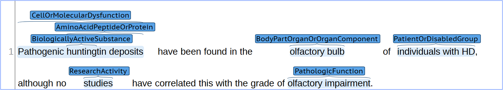

<script src='https://cdnjs.cloudflare.com/ajax/libs/mathjax/2.7.2/MathJax.js?config=TeX-MML-AM_CHTML'></script>


## Named Entity Recognition and Classification on English Medical Texts

The assignment is to **identify** and **classify** all the entities in a list of English documents. These entities are relevant terms, single or multiple words, representing semantically essential elements in a sentence in the **medical domain**. As shown in the figure below, a trained model was used to detect and classify the relevant entities in one of the examples from the test set.



> **NOTE:** certain entities, such as "*Pathogenic huntingtin deposits*," may contain more than one word. Additionally, as depicted in the previous image, a single span can be annotated multiple times for different categories. Furthermore, the spans may either be fully overlapped (with the same beginning and end points) or partially overlapped.

Each example comprises a single sentence stored in a `.txt` file. The annotations provided are saved in `.ann` files in BRAT format. The documents are named as textXXX, where XXX is a number used to identify the example. For every number, a `.txt` and a `.ann` file are available. You should expect to receive the BRAT annotation document for a given example, which includes the detected and classified annotations.

The objective is to create a model that automatically performs the described task.

### Corpora and Taxonomy

For the eHealth-KD 2024 edition, we will be evaluating systems based on a corpus created for the **T2KNOW** research project (INNEST/2022/24). This corpus contains **1701 texts**, which we later split into **x sentences**. These texts were selected based on specific Web of Science (WoS) filters to retrieve information on the following topics:

- *Huntington's Disease*, an autosomal-dominant neurodegenerative disorder.
- *Alzheimer's Disease*, the main cause of dementia.
- *Multiple Sclerosis (oligodendroctye precursor)*, a chronic autoimmune disorder.
- Biomarkers of the *Huntington*, *Alzheimer* and *Multiple Sclerosis* diseases.

Regarding the taxonomy, it was chosen as base the list of the Semantic Types that UMLS includes. This list was refined, removing 34 categories out of 127, as they were outside the interest scope. The remaining 93 categories were grouped so that at the end the list just contains 40 types.

The final categories are:

- Amino Acid Peptide Or Protein, 
- Anatomical Abnormality, Bacterium, 
- Biologic Function, 
- Biologically Active Substance, 
- Biomedical Occupation Or Discipline, 
- Body Part Organ Or Organ Component, 
- Cell, 
- Cell Component, 
- Cell Function, 
- Cell Or Molecular Dysfunction, 
- Chemical, 
- Clinical Attribute, 
- Disease Or Syndrome, 
- Embryonic Structure, 
- Environmental Effect Of Humans, 
- Eukaryote, 
- Experimental Model Of Disease, 
- Finding, 
- Gene Or Genome, 
- Health Care Activity, 
- Health Care Related Organization, 
- Individual Behavior, 
- Injury Or Poisoning, 
- Machine Activity, 
- Manufactured Object, 
- Molecular Sequence, 
- Natural Phenomenon Or Process, 
- Nucleic Acid Nucleoside Or Nucleotide, 
- Organism, 
- Organism Attribute, 
- Pathologic Function, 
- Patient Or Disabled Group, 
- Pharmacologic Substance, 
- Population Group, 
- Research Activity, 
- Sign Or Symptom, 
- Substance, 
- Temporal Concept, 
- Virus.

### Input and output format

Input files in the eHealth-KD 2024 are plain text files in UTF-8 format with one sentence per line.
Sentences have not been preprocesed in any sense.

The output is always **one** file in [BRAT standoff format](https://brat.nlplab.org/standoff.html), where each line represents either an entity or a relation. We provide Python scripts to read and write this format in the repository of the eHealth-KD 2024 Challenge. More details in the [Resources](./resources) section.

For example, the following sentence:

```txt
Pathogenic huntingtin deposits have been found in the olfactory bulb of individuals with HD, although no studies have correlated this with the grade of olfactory impairment.
```

should produce the following output:

```ann
T1 CellOrMolecularDysfunction 0 30 Pathogenic huntingtin deposits
T2 BiologicallyActiveSubstance 11 18 hunting
T3 AminoAcidPeptideOrProtein 11 30 huntingtin deposits
T4 BodyPartOrganOrOrganComponent 54 68 olfactory bulb
T5 PatientOrDisabledGroup 72 91 individuals with HD
T6 ResearchActivity 105 112 studies
T7 PathologicFunction 152 172 olfactory impairment
```

The order in which the entities appear in the output file is irrelevant. Feel free to simply use autoincremental identifiers, or use the provided [Python scripts](). The only requirement is that the output file must be in [BRAT standoff format](https://brat.nlplab.org/standoff.html).

## Challenge Scenario

The eHealth-KD 2024 Challenge proposes one evaluation scenario:

### Main Evaluation

This scenario evaluates the detected and classified entities of a given text. The input consists of plain text, and the expected output will be annotations in BRAT format. Before introducing the formulas, an exact definition of what **Correct**, **Missing**, **Spurious**, **Partial**, and **Incorrect** is, is explained as follows:

- **Correct (C)**: A span is considered correct when the predicted start, end and category 
match the gold standard.
- **Incorrect (I)**: A predicted annotation that has the same start and end position as the 
gold standard but differs in category is incorrect.
- **Partial (P)**: A partial match occurs when a predicted annotation partially coincides in 
position with that of the gold standard, and these have the same category.
- **Missing (M)**: These are all the annotations that should have been predicted but have 
not been detected.
- **Spurious (S)**: All detected annotations that should not have been predicted.

The measures will be **precision**, **recall**, **F1** and **accuracy** as follows:

$$Recall = \frac{C + \frac{1}{2} P}{C + I + P + M} $$

$$Precision = \frac{C + \frac{1}{2} P}{C + I + P + S} $$

$$F_1 = 2 \cdot \frac{Precision \cdot Recall}{Precision + Recall} $$

$$Accuracy = \frac{C + \frac{1}{2} P}{C + I + P + M + S} $$

For every category out of the 40 ones, all the correct, incorrect, partial, missing, and spurious are calculated. Then, for each category, the metrics are computed. Finally, an overall metric is assessed for all the 40 metrics.

> **F1 will determine the ranking of the eHealthKD challenge.**

If in doubt please contact the organizers at [ehealth-kd@googlegroups.com](mailto:ehealth-kd@googlegroups.com).
